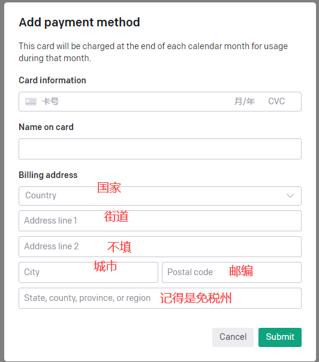

# 设置：安装 & 注册

## 1. [VPN 选择](https://2023vpn.net/)

不做任何推荐，仅个人代码技术层面使用；

## 2. [GPT 申请账号](https://www.awyerwu.com/9273.html)

难点：[虚拟电话号](https://sms-activate.org/?ref=4985285)

**注：** 先选择便宜国家（比如印度）；如果 收不到验证提示，可以 换个欧洲国家 试试；

## 3. [虚拟信用卡](https://nobepay.com/app/card-list)

教程: [从注册到充值开卡全过程](https://juejin.cn/post/7214635327406293051)

+ RMB 充值：最低 500元
+ 需要 KYC 实名认证
+ 地址，填免税州，比如：俄勒冈州，否则要扣税
+ 开虚拟卡费用：1美元
    - 每张虚拟卡 第一次充值 30美元；
    - 费用：充值 + 手续（充值 3%），汇率比实时的贵点；

## 3. 绑卡 到 GPT-API

+ **注：** 不 是 申 请 GPT Plus ！！！

到 [这里](https://platform.openai.com/account/billing/payment-methods) 点 "Add payment method" 添加支付方法；

注册信息 就是 虚拟卡 信息：

## 4. 创建 API-KEY

到 [这里](https://platform.openai.com/account/api-keys) 创建 API-Key，点 "Creae new secret key"

**注：** 这个key只会在生成时显示一次，之后就看不到了，所以生成时候，就要记住；

