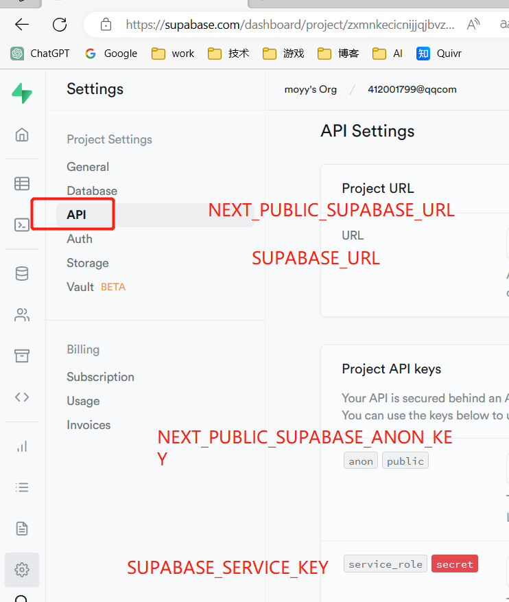

# Quivr

+ [Github 仓库](https://github.com/StanGirard/quivr)
+ [知乎教程](https://www.zhihu.com/question/596838257/answer/3042876737)

## 1. 准备

必须在 Linux 环境，因为docker执行一些 Linux bash 命令。

+ wsl-2 启动 ubuntu 22.04
+ 安装并启动 Docker Desktop
+ 命令行输入 python3.11 有反应
    - [安装 Python 3.11](https://www.linuxcapable.com/how-to-install-python-3-11-on-ubuntu-linux/)
    - sudo apt update  保证包的元信息是最新的
    - sudo apt upgrade 升级过时的软件包
    - sudo add-apt-repository ppa:deadsnakes/ppa -y
        * 可能会失败，失败后不管它，直接执行下面命令看看
    - sudo apt update
    - sudo apt install python3.11
    - python3.11 --version
+ [申请 Supabase 账号](https://supabase.com/dashboard/projects)
    - API 密钥
    - 项目 URL

## 2. 开始

+ git clone https://github.com/StanGirard/quivr.git
+ cd quivr
+ 复制文件 .XXX_env 文件
    - cp .backend_env.example backend/.env
    - cp .frontend_env.example frontend/.env
+ 更新 backend/.env 
    - SUPABASE_URL=Supabase项目URL
    - SUPABASE_SERVICE_KEY=Supabase项目API 密钥
    - OPENAI_API_KEY="sk-XXXXXX"
+ 更新 front/.env
    - NEXT_PUBLIC_SUPABASE_URL=Supabase项目URL
    - NEXT_PUBLIC_SUPABASE_ANON_KEY=Supabase项目API 密钥



## 3. 到 [Supabase](https://supabase.com/dashboard/projects) 的 SqlEditor 输入下面 4个sql代码，创建4张表

https://github.com/StanGirard/quivr/blob/main/scripts/supabase_new_store_documents.sql

https://github.com/StanGirard/quivr/blob/main/scripts/supabase_usage_table.sql

https://github.com/StanGirard/quivr/blob/main/scripts/supabase_vector_store_summary.sql

https://github.com/StanGirard/quivr/blob/main/scripts/supabase_users_table.sql

## 4. docker 安装 / 启动 服务器

注：每次修改完 .env的内容，都要重新 --build

``` bash
docker compose -f docker-compose.yml up --build
```

国内，遇到 SSL 错误，记得 代理

注：Docker 的环境变量是隔离的，不会使用 Ubuntu 的 环境变量；所以 http_proxy 得 单独设置

docker-compose.yml 为 backend 添加 environment 配置；

修改如下：

``` yml
backend:
    env_file:
      - ./backend/.env
    build:
      context: backend
      dockerfile: Dockerfile
    environment:
      http_proxy: http://192.168.XX.YY:ZZZZ
      https_proxy: http://192.168.XX.YY:ZZZZ
      no_proxy: localhost,127.0.0.1,.example.com
```

## 5. 访问页面 

https://localhost:3000

## 6. 每次 启动运行

``` bash
docker compose -f docker-compose.yml up
```

## 7. 问题

### 7.1. wsl2 代理设置

如果你代理服务器 clash for windows 开在 windows端，默认 localhost:7890

要让 wsl2 访问，首先 clash for windows 打开："允许局域网链接"


在 linux bash, 查看下面文件，注意字段 `nameserver`，它就是 windows上的 localhost

``` bash
cat /etc/resolv.conf
```


所以，对windows上的 localhost:7890 对我的 wsl2 的 ubuntu 就是 127.28.31.1:7890