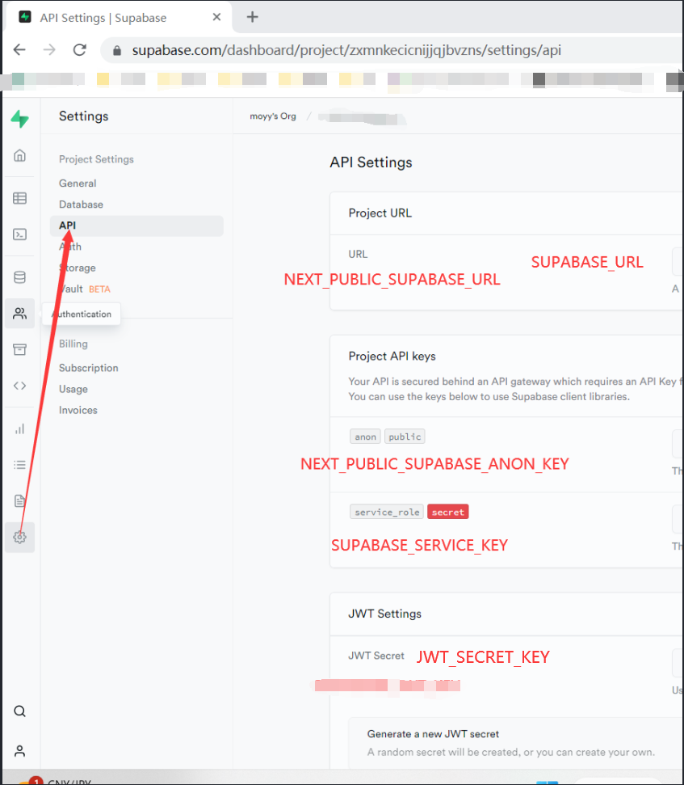
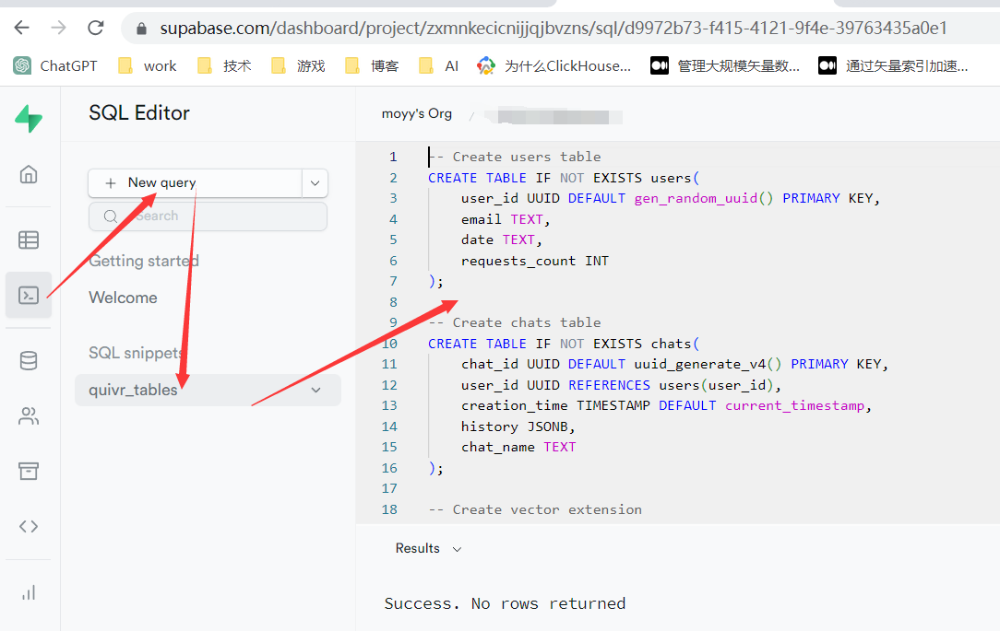
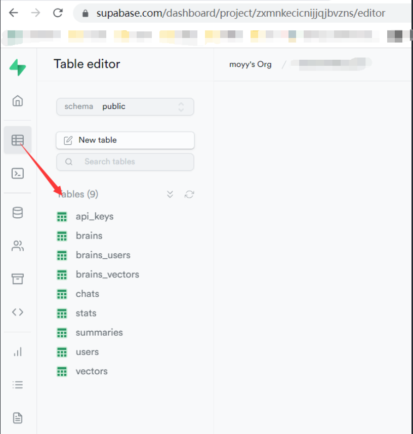

- [Quivr：部署到本地](#quivr部署到本地)
- [01. Quivr 简介](#01-quivr-简介)
- [02. 准备](#02-准备)
- [03. `可选`：Docker 部署 Supabase](#03-可选docker-部署-supabase)
- [04. 这里以 v0.0.30 的 tag 版本为例](#04-这里以-v0030-的-tag-版本为例)
- [05. 替换 backend/.env 的参数](#05-替换-backendenv-的参数)
  - [05.1. 用 官方的 `Supabase`](#051-用-官方的-supabase)
  - [05.2. 用本地部署的 `Supabase`](#052-用本地部署的-supabase)
- [06. 替换 frontend/.env 的参数](#06-替换-frontendenv-的参数)
  - [06.1. 用 官方的 `Supabase`](#061-用-官方的-supabase)
  - [06.2. 用本地部署的 `Supabase`](#062-用本地部署的-supabase)
- [07. 到 本地 supabase 新建 数据库](#07-到-本地-supabase-新建-数据库)
  - [07.1. 用 官方的 `Supabase`](#071-用-官方的-supabase)
  - [07.2. 用本地部署的 `Supabase`](#072-用本地部署的-supabase)
- [08. **Windows（非 WSL）注意**](#08-windows非-wsl注意)
- [09. **国内：** 快速安装 pip](#09-国内-快速安装-pip)
- [10. 国内：Docker 访问 宿主代理](#10-国内docker-访问-宿主代理)
- [11. 构建](#11-构建)
- [12. 以后运行](#12-以后运行)


# [Quivr：部署到本地](https://github.com/StanGirard/quivr)

[Github 备份地址](https://github.com/moyy/langchain_demo/blob/main/src/share/03_quivr/02_local.md)

# 01. Quivr 简介

[Quivr](https://github.com/StanGirard/quivr) 利用 `Supabase` 做向量数据库，加上 `Langchain` / `LLM` 来做 基于各种文档 为主题的 聊天工具 / 知识库

功能：

+ 围绕某个主题 upload 各种文档
+ 围绕某个主题 的 对话
+ 支持 私有 LLM，目前主要是 [GPT4All](https://gpt4all.io/index.html)

框架：

+ 前端 node / next.js
+ 后端：python / supabase / Langchain

支持的 文件 格式：

+ crawl html
  - 如果 url 是 github，直接 获取 源码，目前貌似仅python
  - 否则，就获取这篇html的内容；
+ txt：普通文本
+ Markdown
+ PDF
+ Powerpoint
+ Excel
+ Word
+ Audio / Video 里面的音频流 变 文档

# 02. 准备

+ Windows 11
+ git
+ 可用的 OpenAI API Key
+ 安装 / 启动 Docker Desktop

# 03. `可选`：Docker 部署 Supabase

如果你想保留私有数据的话，可以按 [这篇文章](../07_supabase/01_local_deploy.md) 的方法 部署本地的 `Supabase`

为了方便，也可以用[Supabase官网](https://supabase.com/)的项目。

# 04. 这里以 v0.0.34 的 tag 版本为例

``` bash

# 运行前，请确保当前目录 没有 quivr_34
git clone https://github.com/StanGirard/quivr.git quivr_34

cd quivr_34

git checkout v0.0.34

copy .backend_env.example backend/.env

copy .frontend_env.example frontend/.env

```

# 05. 替换 backend/.env 的参数

+ OPENAI_API_KEY=你的 OpenAI API 密钥

## 05.1. 用 官方的 `Supabase`

+ SUPABASE_URL=Supabase项目URL
+ SUPABASE_SERVICE_KEY=Supabase项目API 密钥
+ JWT_SECRET_KEY="pwXXXXX"



## 05.2. 用本地部署的 `Supabase`

+ SUPABASE_URL=http://localhost:8000
+ SUPABASE_SERVICE_KEY=这里替换成 Supabase本地部署的 `SERVICE_ROLE_KEY` 对应的 值 
+ JWT_SECRET_KEY=这里替换成 Supabase本地部署的 `JWT_SECRET` 对应的 值

# 06. 替换 frontend/.env 的参数

## 06.1. 用 官方的 `Supabase`

+ NEXT_PUBLIC_SUPABASE_URL=Supabase项目URL
+ NEXT_PUBLIC_SUPABASE_ANON_KEY=Supabase项目 Anon API 密钥


## 06.2. 用本地部署的 `Supabase`

+ NEXT_PUBLIC_SUPABASE_URL=http://localhost:8000
+ NEXT_PUBLIC_SUPABASE_ANON_KEY=这里替换成 Supabase本地部署的 `ANON_KEY` 对应的 值

# 07. 到 本地 supabase 新建 数据库

**注：** 如果原来的版本已经有数据表，最好先全部删除，再运行sql脚本

## 07.1. 用 官方的 `Supabase`

+ 将 本地`quivr`目录 的 `scripts/tables.sql` 内容 拷贝 到 supabase 项目 的 `SQL Editor` 去执行

**注：** 这里不能用`Quivr`官网的sql链接，因为不同版本的sql，对应的表格schama不一样！





## 07.2. 用本地部署的 `Supabase`

+ 浏览器打开 Supabase 管理端 http://localhost:3001 
+ 将 本地`quivr`目录 的 `scripts/tables.sql` 内容 拷贝 到 supabase 项目 的 `SQL Editor` 去执行

**注：** 这里不能用`Quivr`官网的sql链接，因为不同版本的sql，对应的表格schama不一样！

# 08. **Windows（非 WSL）注意**

docker-compose.yml 文件，有个 ~/，第二次之后，因为windows的目录权限严格到郁闷，会直接失败。

所以要将 ~/ 改成 ./


``` yml
# 找到这行修改如下 - ~/.config/gcloud:/root/.config/gcloud

  - ./.config/gcloud:/root/.config/gcloud

```

# 09. **国内：** 快速安装 pip

**注：** 不加这个，是2小时；加了这个，是 10-15分钟；

backend/Dockerfile 的 pip install 加上 国内镜像

``` Dockerfile

# 找到这里，替换成下面的 RUN pip install --no-cache-dir -r /code/requirements.txt --timeout 100

RUN pip install --no-cache-dir -r /code/requirements.txt --timeout 100 -i https://pypi.tuna.tsinghua.edu.cn/simple --trusted-host pypi.tuna.tsinghua.edu.cn

```

frontend/Dockerfile 的 pip install 加上 国内镜像

``` Dockerfile

# 找到这里，替换成下面的 RUN pip3 install --no-cache --upgrade pip setuptools

RUN pip3 install --no-cache --upgrade pip setuptools -i https://pypi.tuna.tsinghua.edu.cn/simple --trusted-host pypi.tuna.tsinghua.edu.cn

```

# 10. 国内：Docker 访问 宿主代理

假设用 clash for windows，服务端口为 localhost:7890

那么，如果想在 Docker 里用代理服务，需要改 docker-compose.yml 文件

找到 container_name: backend，在其下一行加入三句，其中 host.docker.internal 对应Docker的宿主主机（也就是你本地电脑）

``` yml
container_name: backend
environment:
    http_proxy: http://host.docker.internal:7890
    https_proxy: http://host.docker.internal:7890
```

# 11. 构建

**国内 Clash：** 运行前，要关闭 clash 全局，只用 规则，否则你会发现要等好久。

``` bash
docker compose -f docker-compose.yml up --build
```

成功后，浏览器访问 http://localhost:3000

# 12. 以后运行

只要不改配置（.env / docker-compose.yml 等），就不用 --build。

可以用命令行，也可以点击 docker desktop 的启动按钮。

``` bash
docker compose -f docker-compose.yml up
```
