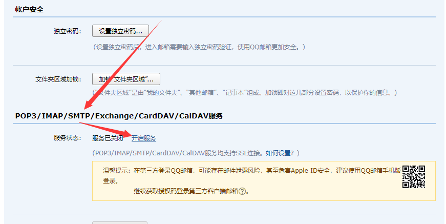

# [Quivr：部署到本地](https://github.com/StanGirard/quivr)

## 1. 准备

+ Windows 11
+ git
+ 安装 / 启动 Docker Desktop

**注意注意注意注意注意：** 开始之前，先到 Docker 删除 `quivr` 的 Container（镜像 可以 保留）

## 2. [Docker 部署 Supabase](https://supabase.com/docs/guides/self-hosting/docker)

### 2.1. 开始

到你想要的目录，进入 cmd 控制台：

``` bash
# Get the code
git clone https://github.com/supabase/supabase

# Go to the docker folder
cd supabase/docker

# Copy the fake env vars
copy .env.example .env

```

### 2.2. 更新 密钥

用 [这里](https://supabase.com/docs/guides/self-hosting/docker#generate-api-keys) 更新 .env:

+ `STUDIO_PORT`=3001    # 这里改成3001，为了和 quivr 起冲突
+ `SITE_URL`=http://localhost:3001
+ `POSTGRES_PASSWORD`=123456      # 数据库密码，你随意
+ `JWT_SECRET`=拷贝 `JWT Secret` 的值
+ `ANON_KEY`=将 `Preconfigured Payload` 切成 `ANON_KEY`，点击 `Generate JWT`, 拷贝 `Generated Token`
+ `SERVICE_ROLE_KEY`=将 `Preconfigured Payload` 切成 `SERVICE_KEY`，点击 `Generate JWT`, 拷贝 `Generated Token`

### 2.3. 关于 邮箱 SMTP_ 服务

作用：因为需要邮箱认证，所以必须要链接一个 SMTP 服务器，才能供其他账号登录和中转，为了方便，以QQ邮箱为例子。

**注意注意注意注意注意：** 实际当中，一定要申请 **企业邮箱** ！

QQ邮箱-设置，账户，开启 SMTP服务，获取授权码





修改 .env 配置

``` yml
## Email auth
SMTP_ADMIN_EMAIL=XXXX@qq.com # 你的邮箱
SMTP_HOST=smtp.qq.com # 固定ip
SMTP_PORT=587         # 固定端口
SMTP_USER=XXXX@qq.com # 你的邮箱
SMTP_PASS=xxxxx # 获取的授权码
SMTP_SENDER_NAME=XXXX # 发信人
```

### 2.4. 再次配置密码：`可能不需要，没试过`

到这里配置网关密码 supabase\docker\volumes\api\kong.yml

``` yml
###
### Consumers / Users
###
consumers:
  - username: anon
    keyauth_credentials:
      - key: 这里替换成上面 `ANON_KEY` 对应的 值
  - username: service_role
    keyauth_credentials:
      - key: 这里替换成上面 `SERVICE_ROLE_KEY` 对应的 值

```


### 2.5. 启动

``` bash
docker compose up
```

成功后，就用浏览器打开: http://localhost:3001

### 2.6. `注意事项`：修改配置后如何生效

如果已经运行了docker之后，发现要修改

凡是 修改了 docker-compose.yml 或者 .env 有关数据库的配置，都要 清理掉数据库的数据。。。

+ rmdir /S /Q volumes\db\data
+ docker compose up --build

## 3. [Quivr 本地化](https://github.com/StanGirard/quivr)

### 3.1. **如果你不想踩坑，一定要** 确定版本

``` bash
# Get the code
git clone https://github.com/StanGirard/quivr.git

# Go to
cd quivr

# 这里对应的是 0.0.28 tag 的 下一个提交版本
# 为什么一定是这个，因为 我试过 0.0.15-0.0.20 全部因为作者的bug而构建失败。
# 所以第一次为了保险，最好和我的版本一致！
git checkout 3e68000983dc69200cbc0b15ed0126e5dd16633d

copy .backend_env.example backend/.env
copy .frontend_env.example frontend/.env

```

### 3.2. 替换 backend/.env 的参数

+ SUPABASE_URL=http://localhost:8000 # 一定是 8000，那个是 supabase 的 kong 网关对应的端口，不是3000，也不是3001
+ SUPABASE_SERVICE_KEY=这里替换成上面 `SERVICE_ROLE_KEY` 对应的 值 
+ OPENAI_API_KEY=GPT-API-密钥
+ JWT_SECRET_KEY=这里替换成上面 `JWT_SECRET` 对应的 值

## 3.3. 替换 frontend/.env 的参数

+ NEXT_PUBLIC_BACKEND_URL=http://localhost:5050
+ NEXT_PUBLIC_SUPABASE_URL=http://localhost:8000
+ NEXT_PUBLIC_SUPABASE_ANON_KEY=这里替换成上面 `ANON_KEY` 对应的 值

### 3.4. 到 本地 supabase 新建 数据库

+ 浏览器打开 Supabase 管理端 http://localhost:3001 点击 项目（**注：** 本地部署的supabase不能新建项目，只有一个默认项目）
+ 跟官网一样，到 sql editor，将 本地 quivr 目录 的 scripts/tables.sql 的sql代码拷贝过去执行；
  - **注1：** sql 不能到 github 拷贝，因为每个代码版本的sql可能不一样，如果你不想浪费时间，就一个版本对应一个数据库！
  - **注2：** 因为 quivr 自己都不稳定，所以升级代码后，发现更新sql后崩溃，请忍痛删掉已有数据，或者 找个数据库高手，请教下怎么才能兼容性升级！

### 3.5. **Windows 需要：** Linux 请忽略

docker-compose.yml 文件，有个 ~/，第二次之后，因为windows的目录权限严格到郁闷，会直接失败。

所以要将 ~/ 改成 ./


``` yml
# 找到这行修改如下 - ~/.config/gcloud:/root/.config/gcloud

  - ./.config/gcloud:/root/.config/gcloud

```

### 3.6. **国内：** 快速安装 pip

**注：** 不加这个，是2小时；加了这个，是 10-15分钟；

backend/Dockerfile 的 pip install 加上 国内镜像

``` Dockerfile

# 找到这里，替换成下面的 RUN pip install --no-cache-dir -r /code/requirements.txt --timeout 100

RUN pip install --no-cache-dir -r /code/requirements.txt --timeout 100 -i https://pypi.tuna.tsinghua.edu.cn/simple --trusted-host pypi.tuna.tsinghua.edu.cn

```

frontend/Dockerfile 的 pip install 加上 国内镜像

``` Dockerfile

# 找到这里，替换成下面的 RUN pip3 install --no-cache --upgrade pip setuptools

RUN pip3 install --no-cache --upgrade pip setuptools -i https://pypi.tuna.tsinghua.edu.cn/simple --trusted-host pypi.tuna.tsinghua.edu.cn

```

### 3.7. 构建

**国内：** 运行前，因为你前面加了国内镜像，要关闭 clash 这些代理工具（至少要关闭全局功能），否则你会发现要等几小时。

``` bash

docker compose -f docker-compose.yml up --build

```

**国内：** 15分钟后，你会发现安装成功，启动崩溃！所以还有最后一步！

### 3.8. **国内：** 访问 宿主代理

等上面安装成功，初始化崩溃之后，就可以 打开 clash 这些代理工具了；

假设你买的是本地代理服务，比如 你本地 可以通过 localhost:7890 代理 http / https

那么，如果想在 Docker 程序 也是用代理，需要改 docker-compose.yml 文件

找到 container_name: backend，在其下一行加入三句，其中 host.docker.internal 对应Docker的宿主主机（也就是你本地电脑）

``` yml

container_name: backend
environment:
  http_proxy: http://host.docker.internal:7890
  https_proxy: http://host.docker.internal:7890
```

命令行再次运行：

``` bash

docker compose -f docker-compose.yml up --build

```

成功后，浏览器访问 http://localhost:3000 