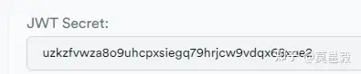
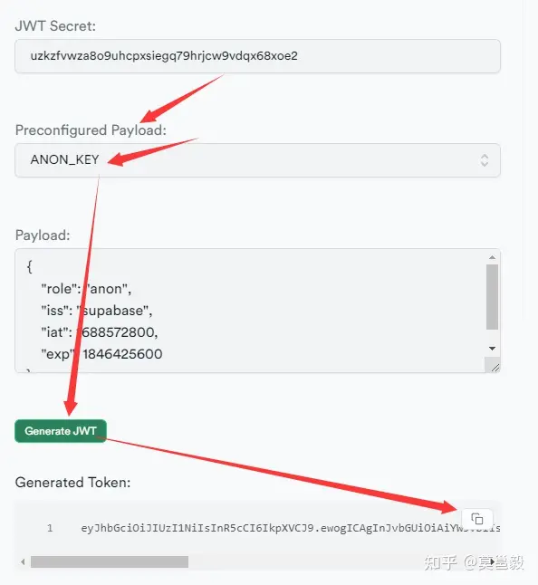
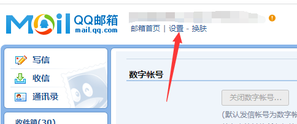
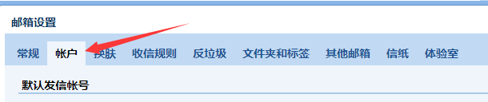
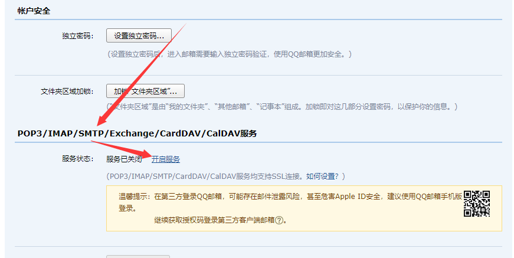
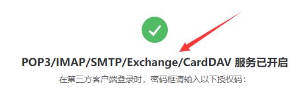

- [通过`Docker`本地部署`Supabase`](#通过docker本地部署supabase)
- [1. 说明](#1-说明)
  - [1.1. 功能](#11-功能)
  - [1.2. FAQ](#12-faq)
- [2. 准备](#2-准备)
- [3. 开始](#3-开始)
- [4. 更新 密钥：用 这里 更新 .env](#4-更新-密钥用-这里-更新-env)
- [5. 关于 邮箱 SMTP\_ 服务](#5-关于-邮箱-smtp_-服务)
- [6. 配置 Kong 网关密钥](#6-配置-kong-网关密钥)
- [7. 启动](#7-启动)
- [8. `注意事项`：修改配置后如何生效](#8-注意事项修改配置后如何生效)

# [通过`Docker`本地部署`Supabase`](https://supabase.com/docs/guides/self-hosting/docker)

[Github 备份地址](https://github.com/moyy/langchain_demo/blob/main/src/share/07_supabase/01_local_deploy.md)

# 1. 说明

Supabase 是 开源的 Baas 产品，`Firebase`的开源替代品

Baas: Backend as a service 后端及服务

## 1.1. 功能

+ PostgresSql + 嵌入向量支持
+ Auth: 身份验证和授权
+ 自动生成 HTTP API: Restful / GraphQL
+ 基于 WebSocket 的 实时订阅
+ 文件对象存储：上传，下载
+ 边缘函数

## 1.2. FAQ

**问题1**：为什么要部署到本地？

因为有些项目需要私有数据，比如公司内部的数据库等；

**问题2**：本地部署 & 官网 区别是什么？

+ 本地部署 貌似不支持 新建 项目；
+ 本地部署 的 项目 url，貌似 只有 localhost:8000 连接到 kong 网关？

# 2. 准备

+ Windows 11
+ git
+ 安装 / 启动 Docker Desktop

# 3. 开始

到你想要的目录，进入 cmd 控制台：

``` bash
# Get the code
git clone https://github.com/supabase/supabase

# Go to the docker folder
cd supabase/docker

# Copy the fake env vars
copy .env.example .env

```

# 4. 更新 密钥：用 [这里](https://supabase.com/docs/guides/self-hosting/docker#generate-api-keys) 更新 .env

|键|值|说明|
|--|--|--|
|`STUDIO_PORT`|3001|改成3001为了避免和 quivr 起冲突|
|`SITE_URL`|http://localhost:3001||
|`POSTGRES_PASSWORD`|123456|数据库密码，按自己意愿设置|
|`JWT_SECRET`|拷贝 `JWT Secret` 的值|注：每次刷新页面，会随机生成该值，所以请用同一个 JWT 生成下面两个键对应的值！|
|`ANON_KEY`|将 `Preconfigured Payload` 切成 `ANON_KEY`，点击 `Generate JWT`, 拷贝 `Generated Token`||
|`SERVICE_ROLE_KEY`|将 `Preconfigured Payload` 切成 `SERVICE_KEY`，点击 `Generate JWT`, 拷贝 `Generated Token`||






# 5. 关于 邮箱 SMTP_ 服务

作用：因为需要邮箱认证，所以必须要链接一个 SMTP 服务器，才能供其他账号登录和中转，为了方便，以QQ邮箱为例子。

**注意：** 实际当中，一定要申请 **企业邮箱**，以 Outlook 邮箱为主

QQ邮箱-设置，账户，开启 SMTP服务，获取授权码










修改 .env 配置

``` yml
## Email auth
SMTP_ADMIN_EMAIL=XXXX@qq.com # 你的邮箱
SMTP_HOST=smtp.qq.com # 固定ip
SMTP_PORT=587         # 固定端口
SMTP_USER=XXXX@qq.com # 你的邮箱
SMTP_PASS=xxxxx # 获取的授权码
SMTP_SENDER_NAME=XXXX # 发信人
```

# 6. 配置 Kong 网关密钥

不配置这个，quivr 注册和登录时，会报错；

到这里配置网关密码 supabase\docker\volumes\api\kong.yml

``` yml
###
### Consumers / Users
###
consumers:
  - username: anon
    keyauth_credentials:
      - key: 这里替换成上面 `ANON_KEY` 对应的 值
  - username: service_role
    keyauth_credentials:
      - key: 这里替换成上面 `SERVICE_ROLE_KEY` 对应的 值

```

# 7. 启动

``` bash
docker compose up
```

成功后，就用浏览器打开: http://localhost:3001

# 8. `注意事项`：修改配置后如何生效

个人实际情况：修改了 `docker-compose.yml` 或者 `.env` 有关数据库的配置，都要 清理掉数据库的数据。

+ rmdir /S /Q volumes\db\data
+ docker compose up
